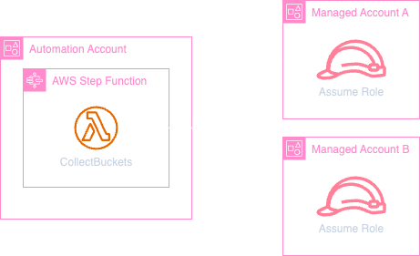
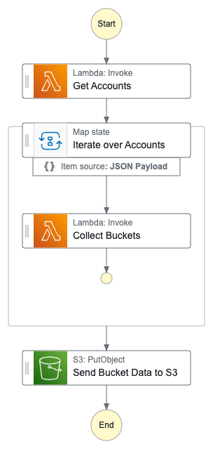

<div style="position:relative;color:#fff;height:300px;margin-bottom:20px;">
<div style="background-size:cover;background-blend-mode:overlay;background-image: url('https://assets-global.website-files.com/62f05da360a799388d4a0d2e/651727f71fc51dba936bd23f_fotor-ai-20230929153857.jpeg');position:absolute;inset:0;" align="center">
</div>
<div style="background-size:cover;background-blend-mode:overlay;background-color:rgba(0,0,0,0.5);position:absolute;inset:0;display:flex;flex-direction:column;align-items:center;justify-content:center;">
<h1 style="font-weight:bold;margin:0;padding:0;">☁️ AWS Multi-Account Automation Lab ☁️</h1>
    <h3 style="font-size: 1rem;margin:0;padding:0 0 20px 0"><em>presented by Echelon One</em></h3>
    <p style="padding:0 40px;">Automate tasks across multiple AWS accounts easily! This repository offers a powerful solution based on AWS Step Functions. See how it simplifies multi-account management by automatically collecting S3 bucket information from all your accounts and storing it in a central location.</p>
    </div>
</div>

- [🏆 Key Features](#-key-features)
- [🗺️ Overview](#️-overview)
- [🛑 Before you start](#-before-you-start)
- [🏗️ Deployment](#️-deployment)
    - [Deploy solution to automation account](#deploy-solution-to-automation-account)
    - [Deploy IAM Roles to Managed Accounts](#deploy-iam-roles-to-managed-accounts)
- [🚀 Run Stepfunction](#-run-stepfunction)
- [✅ Check status of Stepfunction Execution](#-check-status-of-stepfunction-execution)
- [📈 Review Collected Data from S3](#-review-collected-data-from-s3)
- [🧹 Cleanup the environment](#-cleanup-the-environment)
    - [Remove IAM roles from Managed Accounts](#remove-iam-roles-from-managed-accounts)
    - [Remove solution from Automation Account](#remove-solution-from-automation-account)
- [FAQ](#faq)

## 🏆 Key Features

> Automated Data Collection: Leverages Step Functions to define and execute a workflow that retrieves data from specified AWS accounts.

> Cross-Account Access: Employs AWS IAM roles and permissions to securely access resources across accounts.

> Centralized Storage: Aggregates collected data into a central location

> Flexibility and Customization: Tailor activities to your specific needs.

## 🗺️ Overview

<div style="display:flex;align-items:center;justify-content:space-between">


</div>

The left image shows how the Automation Account interacts with Managed Accounts. Its Step Function uses Lambda functions that automatically switch identities to each Managed Account, thanks to roles set up by CloudFormation.

The three-step process outlined in the right image uses Step Functions to manage data collection across accounts. It starts with a Lambda function retrieving a list of accounts. Then, a Map function iterates through each account, triggering another Lambda function to gather desired information (buckets) in each case. Finally, all collected data is saved to an S3 storage bucket.

## 🛑 Before you start

It's essential to have the AWS CLI installed and configured on your system and temporary credentials (STS tokens) or permanent credentials (access keys) set up for your accounts. Please refer to [AWS documentation](https://docs.aws.amazon.com/cli/latest/userguide/getting-started-quickstart.html) for setup.

This is a sample solution, that is meant to be expanded on. For demonstration purposes the Lambda function retrieving a list of accounts does not make an API call out of the box but simply returns a dictionary of account ids and aliases.

Edit `line 30` in `./cloudformation/solution-stepfunction.yml` with your **managed account(s)** details by replacing `return {"accounts":[]}` with something like

```python
return {"accounts":[{"id":"222222222222",'alias':"account a"},{"id":"1111111111111",'alias':"account b"}]}
```

> make sure to adhere to the spacing within the yaml file, python is space sensitive.

The following instructions perform the required actions via the AWS CLI. Remember that you can also do the below activites via the AWS Console.

## 🏗️ Deployment

#### Deploy solution to automation account

> **⚠️ Switch your AWS CLI identity using profiles/STS to the automation account**

Deploy the CloudFormation template with the below command.

```
aws cloudformation deploy --template-file ./cloudformation/solution-stepfunction.yml --stack-name automation-lab --capabilities CAPABILITY_NAMED_IAM
```

Retrieve the lambda function execution IAM role arn that was created by the template by running the below command.

```
aws iam get-role --role-name CollectBucketsFunctionRole --query 'Role.Arn' --output text
```

#### Deploy IAM Roles to Managed Accounts

> **⚠️ Switch your AWS CLI identity using profiles/STS to each managed account**

Deploy the CloudFormation template with the below command (passing previous step's role ARN).

```
aws cloudformation deploy --template-file ./cloudformation/account-assume-role.yml --stack-name automation-lab-assume-role --parameter-overrides MgmtRoleArn="<RoleArn>" --capabilities CAPABILITY_NAMED_IAM
```

## 🚀 Run Stepfunction

> **⚠️ Switch your AWS CLI identity using profiles/STS to the automation account**

Get the Stepfunction Arn with the following command -

```
aws cloudformation list-stack-resources --stack-name automation-lab --query 'StackResourceSummaries[?LogicalResourceId==`CollectorStateMachine`].PhysicalResourceId' --output text
```

Run the Stepfunction with the below command, replace `StepFunctionArn` with the Arn from the above command.

```
aws stepfunctions start-execution --state-machine-arn <StepFunctionArn> --input '{}' --query 'executionArn' --output text
```

## ✅ Check status of Stepfunction Execution

The above command returns the execution arn of the running stepfunction workflow. Check the status of the execution by running the following command, replace `ExecutionArn` with the Arn from the above command

```
aws stepfunctions describe-execution --execution-arn <ExecutionArn> --query 'status' --output text
```

## 📈 Review Collected Data from S3

Retrieve the S3 bucket name by running the following command -

```
aws cloudformation list-stack-resources --stack-name automation-lab --query 'StackResourceSummaries[?LogicalResourceId==`DataCollectionBucket`].PhysicalResourceId' --output text
```

Execute the following command to get the dataset, replace `BucketName` with the output from the above command

```
aws cloudformation list-stack-resources --stack-name automation-lab
aws s3 cp s3://<BucketName>/buckets.json -
```

## 🧹 Cleanup the environment

#### Remove IAM roles from Managed Accounts

> **⚠️ Switch your AWS CLI identity using profiles/STS to each managed account**

```
aws cloudformation delete-stack --stack-name automation-lab-assume-role
```

#### Remove solution from Automation Account

> **⚠️ Switch your AWS CLI identity using profiles/STS to the automation account**

Before you can run this command you will need to delete any objects in the S3 bucket.

```
aws cloudformation delete-stack --stack-name automation-lab
```

## FAQ

> Q: Will this cost money?
> A: All resources deployed fall into free tier usage limits, make sure you clean up the environment after use

> Q: Is this usable in production?
> A: The provided solution is meant as a starting point for your automation efforts. Production readiness would likely include updating the lambda function that provides accounts, as well as security hardening per individual required standards (e.g. CMK encryption of S3 bucket objects).

> Q: How do I trigger this to regularly export the data?
> A: You could schedule this step function to execute with the AWS EventBridge Scheduler.

<div style="position:relative;color:#fff;height:100px;">
<div style="background-size:cover;background-blend-mode:overlay;background-image: url('https://assets-global.website-files.com/62f05da360a799388d4a0d2e/651726b90f09a6cf0b26e07e_fotor-ai-20230929153311.jpeg');position:absolute;inset:0;" align="center">
</div>
<div style="padding:10px;background-size:cover;background-blend-mode:overlay;background-color:rgba(0,0,0,0.5);position:absolute;inset:0;display:flex;flex-direction:column;align-items:center;justify-content:center;">
<a href="https://www.echelonone.app" style="color:#fff;margin:0;padding:0;">Ready for the next level? Chart your course to <strong>echelonone.app</strong></a>
</div>
